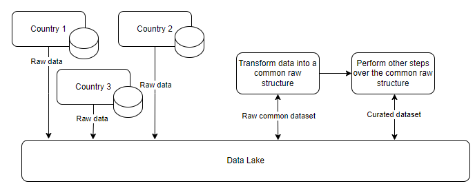

# ecommerce-etl

## Task

**Dataset:** [Brazilian E-Commerce Public Dataset by Olist | Kaggle](https://www.kaggle.com/datasets/olistbr/brazilian-ecommerce)

**Objective:** We want to forecast for each item, what are the sales going to be next week.

**Expectation:**
1. Code to load relevant tables for the task (minimum tables needed), and prepare efficient ETL that builds a dataset on which Data Scientist can continue the work (use pandas)
    
    a. The output should be in parquet, well partitioned by product
    
    b. The format of output is a single table that can be used for modelling (no need to extract features).
2. python script to run code, that you can pass arguments to
3. A couple of simple pytest tests, and run them in github actions at every PR.
4. Configuration files in yml
5. Think about the following:
    
    a. Which features would you extract and how from the tables? How would you use the remaining tables?
    
    b. How would you turn it into an application in production?
    
    c. How would you design an application if you knew that you would have to build a similar solution for a couple other countries, and the data schema might be different for them, however, you can get the same underlying data?

## ETL process description

1. Load data from the following datasets into pandas dataframe.
    * olist_products_dataset.csv
    * olist_orders_dataset.csv
    * olist_order_items_dataset.csv
2. Apply transformations for each dataset according to the definitions in `etl_params.yml` (more details [here](#config-file)).
    * Remove duplicated lines
    * Fill missing values
    * Cast datatypes
3. Join the cleansed datasets to create an unified dataset.
4. Load the unified dataset to an output path in parquet format, partitioned by `product_category_name`. Output path and partition columns can be configured in `etl_params.yml` (more details [here](#config-file)).
    * `product_category_name` was chosen as partition column because as most analysis will be done by product, the user can work on small pieces filtering by category first. Other options like using `product_id` doesn't seem a good option for this dataset because we have a lot of distinct products with few data, adding unecessary overhead to manage a huge amount of partitions with small files.

The whole process uses pandas as requested.

The datasets above were selected because they have the most relevant information about product features and sales that can be valuable to understand past performance of product sales and predict the future sales.

## How to run the code?

1. Clone the project
2. Download the following datasets from [Brazilian E-Commerce Public Dataset by Olist | Kaggle](https://www.kaggle.com/datasets/olistbr/brazilian-ecommerce) and extract them to the folder `/data/raw`
    * olist_products_dataset.csv
    * olist_orders_dataset.csv
    * olist_order_items_dataset.csv
3. Inside the project folder, install the requirements:
    ```
    pip install -r app/requirements.txt
    ```
4. Run the ETL:
    ```
    cd app
    python etl.py --param_file etl_params.yml
    ```

## Config file

Please, use the `etl_params.yml` as a model. In this file you can parametrize the following:

Datasets:
* `source_file`: Dataset file source location.
* `source_file_params`: Additional file paramaters such as column delimiter (`sep`). Refer to [this](https://pandas.pydata.org/pandas-docs/stable/reference/api/pandas.read_csv.html) documentation to check the possible parameters.
* `key_columns`: Columns to be considered as primary keys - used to remove duplicity.
* `type_cast`: Key:value where key is the pandas datatype and the value is a list of columns to be cast to this datatype (reference [here](https://pandas.pydata.org/docs/reference/api/pandas.DataFrame.astype.html)).
* `fill_missing`: Key:value where key is the column name and the value is the value to be filled when missing is encountered (reference [here](https://pandas.pydata.org/docs/reference/api/pandas.DataFrame.fillna.html)).

Output:
* `output_path`: Output path where the parquet files will be saved.
* `partition_columns`: List of columns to be used to partition the output dataset.

## Tests

A couple of tests are parametrized to run when a PR is opened. 

Github actions workflow details [here](https://github.com/cordon-thiago/ecommerce-etl/blob/main/.github/workflows/main.yml).

Tests detail [here](https://github.com/cordon-thiago/ecommerce-etl/blob/main/app/tests/test_etl.py).

## Extra questions
Which features would you extract and how from the tables? How would you use the remaining tables?

> Some features I would extract:
> * **Day of week:** we can have different sales patterns on weekends for example. It's possible to extract from `order_purchase_timestamp` using [weekday](https://pandas.pydata.org/docs/reference/api/pandas.Series.dt.weekday.html) function.
> * **Past sales volume:** aggregate the sales in last weeks to capture trends (sales in last week, last 2 weeks, and other time frames).
> * **Freight:** cheaper freights may affect the sales (column `freight_value`).
> * **Product price:** the product price may affect the demand (column `price`).
> 
> Some other tables I would use:
> * olist_customers_dataset.csv: collect customer demographics.
> * olist_sellers_dataset.csv: collect seller demographics.
> * olist_order_reviews_dataset.csv: use the review text to extract sentiment analysis to use in sales prediction.

How would you turn it into an application in production?
> Considering that in production the data volume would be much more than in this exercise, I recommend using a more scalable approach such as a Spark application so we can use almost the same structure and principle used for this exercise but in a much more scalable way.
Airflow (or any other orchestration tool) can also be used to orchestrate the ETL steps.

How would you design an application if you knew that you would have to build a similar solution for a couple other countries, and the data schema might be different for them, however, you can get the same underlying data?

> I would follow an approach like this (high level):
> * Each country generates data (CDC / Kafka events /etc) into a storage (Data lake in this image) as they are.
> * An application reads these raw data and uniformizes them, creating a unique schema. Depending on the level of transformation needed, it can be abstracted into some parametrization file and used by the application in runtime. The output is a uniformized data structure.
> * The uniformized data structure created in the step above is the input for other transformation processes that are required to create a curated dataset, so we don't need to have custom applications for each country because of different inputs.
> * The process is "plug and play" - to onboard new countries, all we need is to connect this country in the storage and parametrize the new mapping to the uniformized data structure.
>
> 


